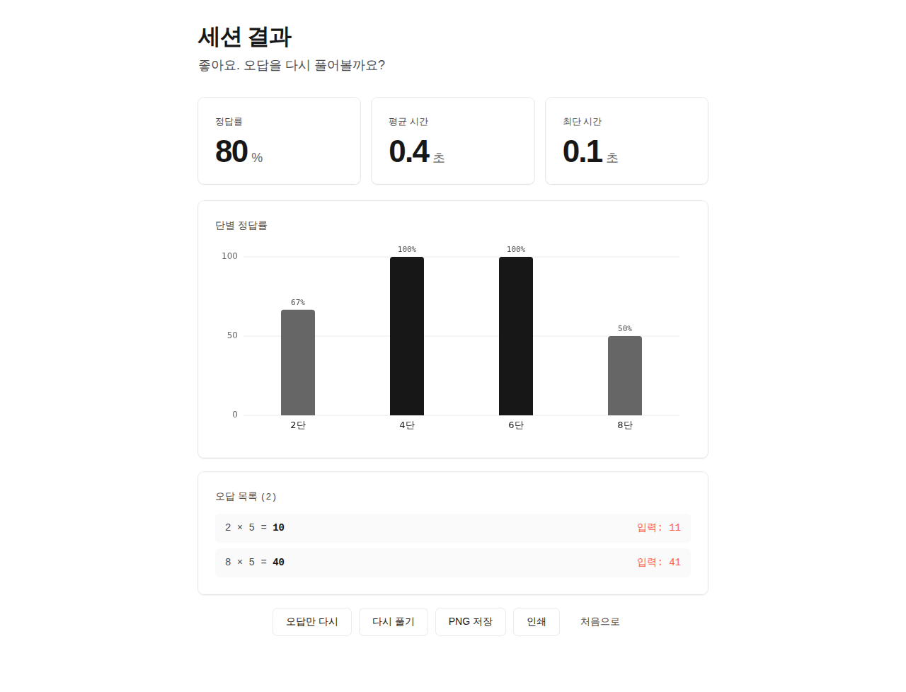
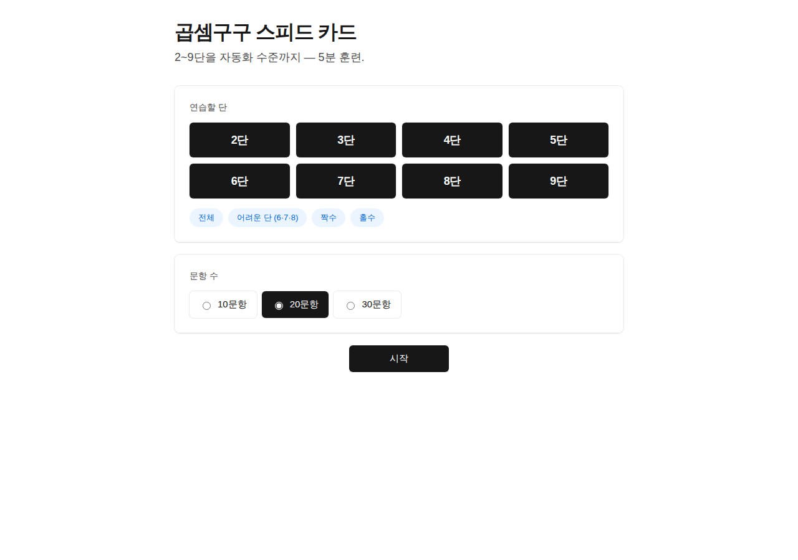
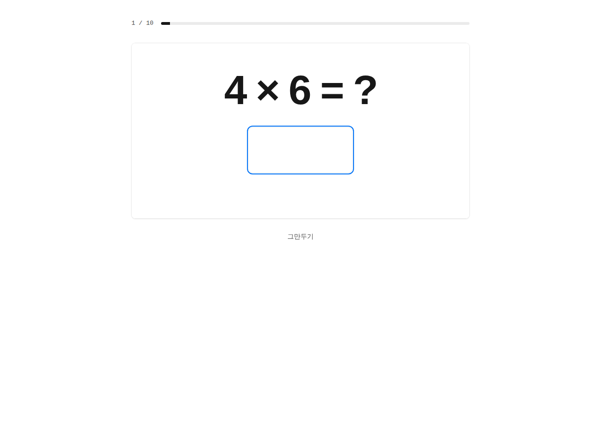

# Day 7 — 곱셈구구 스피드 카드 (Multiplication Speed Cards)

> 1일 1바이브코딩 챌린지 · `#007` · 수학 · 3~4학년 1:1

2~9단 곱셈구구를 무작위로 출제하고, 즉시 채점하면서 **응답시간까지 측정**해 자동화 수준을 "수치"로 보여주는 단일 페이지 웹앱.

🔗 **배포**: https://989-alt.github.io/project-07-gopsem-gugu-seupideu-kadeu/



## 핵심 기능

- **단 선택** — 2~9단 개별 토글 + 프리셋 4개 (전체 / 어려운 단 6·7·8 / 짝수 / 홀수). 최소 1개 단은 항상 유지.
- **무작위 출제** — Fisher–Yates 셔플, 직전 카드와 연속 같은 문제 회피.
- **즉시 채점 + 응답시간 측정** — 카드 표시 순간부터 `performance.now()` 측정. 자리 수가 차면 자동 채점, Enter 도 가능.
- **단별 정답률 차트** — vanilla `<canvas>` 로 막대그래프 자체 렌더. 정답률 50% 미만 단은 빨강으로 시각적 약점 신호.
- **오답만 다시** — 결과 화면에서 오답 카드만으로 즉시 재세션.
- **PNG 저장 / 인쇄** — 결과 화면을 캔버스로 합성해 PNG 다운로드. 인쇄 친화 `@media print` 스타일.
- **직전 기록 비교** — 마지막 세션 결과를 localStorage에 1개만 보관해 첫 화면에 1줄 요약.

## 의도적으로 뺀 것 (scope creep 차단)

- ❌ 학급 랭킹·등수 비교 (자기 효능감 훼손)
- ❌ 사진·이름·번호 같은 개인정보 입력
- ❌ 강제 카운트다운 ("3초 안에 답!" 같은 시간 압박)
- ❌ 광고·외부 트래커·analytics
- ❌ 서버 저장. localStorage 단독.

## 기술 스택

- **단일 HTML + vanilla CSS + vanilla JS** — 빌드 단계 없음, CDN 의존 **0**.
- 차트도 외부 라이브러리 없이 `<canvas>` 자체 렌더 (devicePixelRatio 반영).
- Chart.js CDN을 처음엔 후보로 두었으나, 학교 크롬북 환경의 CDN 차단을 고려해 자체 구현으로 결정.
- **Gemini API 미사용** — 토픽 정의(#007) 상 AI 불필요. 키 노출 없음.

## 실행 방법

### 로컬
```bash
git clone https://github.com/989-alt/project-07-gopsem-gugu-seupideu-kadeu.git
cd project-07-gopsem-gugu-seupideu-kadeu
python3 -m http.server 5180 --bind 127.0.0.1
# http://127.0.0.1:5180 에 접속
```

또는 그냥 `index.html` 을 브라우저로 직접 열어도 동작.

### e2e 테스트
```bash
pip install playwright
python3 -m playwright install chromium

python3 /path/to/with_server.py \
  --server "python3 -m http.server 5180 --bind 127.0.0.1 --directory ." --port 5180 \
  -- python3 tests/e2e.py
```

13개 시나리오 (랜딩 → 프리셋 → 단 토글 가드 → 10문항 풀이 → 결과 → 오답만 다시 → 직전 기록 → 도중 그만두기 → 접근성 → 모바일)가 모두 통과합니다.

## 화면

| 설정 | 카드 | 결과 |
| :--: | :--: | :--: |
|  |  |  |

## 접근성

- 색 대비 **AAA** 수준 (#171717 on #ffffff = 16.6:1).
- 모든 interactive 요소에 `:focus-visible` 2px 파란 outline.
- 단 토글에 `aria-pressed` / 진행률 bar에 `role="progressbar"`.
- 답 입력에 `inputmode="numeric"` — 모바일에서 숫자 키패드 자동 호출.
- `prefers-reduced-motion` 존중 — 흔들기 애니메이션 비활성화.
- 키보드만으로 전 과정 조작 가능.

## 적용한 skill

- `brainstorming` — MUST / SHOULD / MUST NOT 분류로 기능 범위 고정.
- `ui-ux-pro-max` — 접근성·터치 타겟·반응형 가이드.
- `senior-devops` — (CI/CD 부분 제외) 품질·구조 원칙만 차용. 단일 HTML 정적 사이트엔 빌드 파이프라인 불필요.
- `webapp-testing` — Playwright + `with_server.py` 헬퍼로 13 시나리오 e2e.

## 디자인 시스템

**Vercel** (흑백 정밀 · Geist · shadow-as-border) — `awesome-design-md-main` 의 `design-md/vercel/DESIGN.md`.

수학 자동화 훈련이라는 토픽 특성 — "수치를 정직하게 보여준다" — 와 Vercel의 미니멀 정밀함이 잘 맞아 선택. 액센트 색(Develop Blue / Ship Red) 은 결과 시각화 한정으로만 사용.

## 라이선스

이 프로젝트는 1일 1바이브코딩 챌린지의 결과물입니다. 학교·가정에서 자유롭게 사용·수정 가능.
